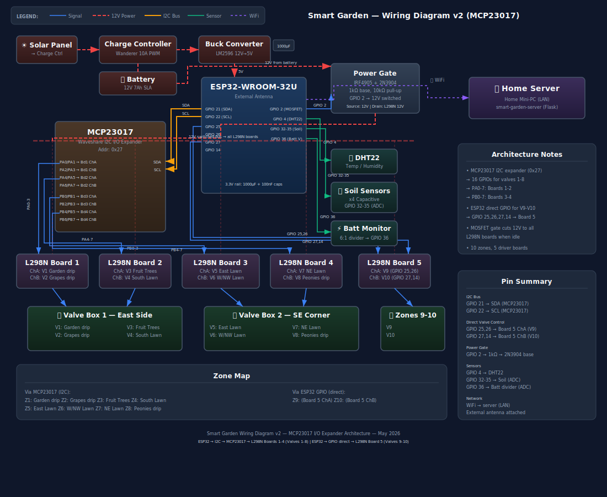
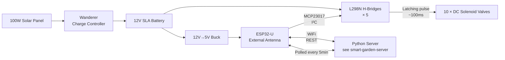

# Smart Garden — ESP32 Solar Sprinkler Controller

Solar-powered, battery-backed ESP32 firmware that drives **10 DC latching solenoid valves** over an MCP23017 I/O expander and an L298N H-bridge. Lives in a weatherproof box at the back of my yard, talks to a companion Python server ([smart-garden-server](https://github.com/jamesearlpace/smart-garden-server)) over WiFi, and irrigates based on an evapotranspiration model instead of a wall-clock timer.

This is the **firmware half** of a personal home-automation project. The Python brain that decides when and how long to water lives in the companion repo.



---

## What it does

- **10 zones, latching solenoids.** Pulses each valve open or closed in ~100 ms — no continuous coil draw, so a 12 V SLA + 100 W solar panel runs the whole rig indefinitely.
- **REST API on the LAN.** `/api/status`, `/api/valve`, `/api/closeall`, `/api/events`, `/api/reboot` — the Python server polls every 5 min, the chip never has to phone home.
- **Survives a brain-dead server.** If the controller hasn't heard from the server in 24 hours, it falls back to a built-in conservative watering schedule so the lawn doesn't die during an outage.
- **Independent hard cap.** Firmware force-closes any valve open longer than 95 minutes, regardless of what the server says. Belt-and-suspenders against crashed schedulers and lost close-ACKs.
- **Adaptive WiFi TX power.** Walks a 4-step ladder (8.5 → 19.5 dBm) based on RSSI, saving 30–60 mA when the AP signal is strong.

---

## Architecture



- **Power path:** Solar → charge controller → SLA → buck converter for the ESP32, direct 12 V to the H-bridges via a P-FET power gate (LOW when idle to save quiescent current).
- **Valve actuation:** Each solenoid is wired through an L298N. Open = pulse IN1 high for 100 ms, close = pulse IN2 high for 100 ms. Latching means the valve stays in position with zero holding current.
- **I/O expansion:** 8 of the 10 valves hang off an MCP23017 on I²C; 2 use direct ESP32 GPIO. The mixed model dropped out of necessity (ran out of MCP pins) but ended up being a nice escape hatch for the "I broke one of the expander pins" situation.

---

## Engineering decisions worth pointing out

A few choices that aren't obvious from reading the code:

**Latching solenoids over standard 24 VAC valves.** A standard sprinkler valve needs continuous current to stay open. On solar, that's a non-starter — running 2 valves at once would flatten the battery overnight. Latching solenoids draw current only during the open/close pulse, so the worst-case daily energy is roughly *number of valve cycles × pulse energy*. A 35 Ah battery has months of runway.

**Independent firmware hard cap on valve runtime.** When I was developing the server I had three different bugs that left a valve open: a `Process.kill` that didn't reap the cycle thread, a network partition that lost the close-ACK, and a server crash mid-cycle. Each one flooded a zone. The firmware now ignores all of them — `VALVE_HARD_MAX_MS` (95 min) is a hardware-level timeout the server can't override. This is the cheapest insurance you'll ever write.

**WiFi modem sleep, not CPU light sleep.** Tried CPU light sleep first to save power. Caused the Eero mesh to deauth the chip within 5 minutes every time. Stripped it back to modem sleep only — radio sleeps between DTIM beacons (~30–50 mA savings), CPU stays awake. No more deauths. See `WIFI_MODEM_SLEEP_ENABLED` in `config.h.example`.

**Adaptive TX power with hysteresis.** Fixed TX at 19.5 dBm was about 80 mA of avoidable draw when the chip is 3 m from the AP. The ladder steps down to 8.5 dBm above –50 dBm RSSI and steps back up below –65 dBm. The dead band prevents oscillation. Net savings is ~60 mA most of the day.

**Boot brownout fix: low TX during boot, high TX after WiFi associates.** The buck converter couldn't supply the inrush of WiFi radio + chip boot at 19.5 dBm — chip would brownout-reset in a loop. Fix: boot at 8.5 dBm, raise to full power only after `WiFi.status() == WL_CONNECTED`. Took embarrassingly long to find with a multimeter and a scope.

**Task watchdog (TWDT) at 60 s.** Catches loops that hang on a stuck I²C transaction or a wedged HTTP handler. Reboots the chip, increments a crash counter in NVS; ≥20 consecutive crashes flips it into safe mode (slower CPU, no valve commands accepted) until manually cleared.

---

## Hardware

| Component | Notes |
|-----------|-------|
| ESP32-U (external antenna) | The U variant matters — internal antenna couldn't hold a link from the back of the yard. |
| MCP23017 | I²C I/O expander at 0x27. Provides 16 GPIO; uses 14 for the H-bridge inputs. |
| 5 × L298N | One per pair of valves. IN1 = open pulse, IN2 = close pulse. Heat sinks on all. |
| 10 × DC latching solenoid valves | 12 V, 100 ms pulse to switch position. |
| Renogy Wanderer 10A | PWM charge controller. Cheap, works. |
| 100 W solar panel + 35 Ah SLA | Lives on the south fence. |
| P-FET power gate + NPN level shifter | Disconnects the H-bridge 12 V rail when idle. Quiescent went from ~150 mA to ~25 mA. |
| 4.7 Ω + 1000 µF input filter | Killed the boot brownout — see decisions above. |

Full wiring diagram in [docs/wiring-diagram.svg](docs/wiring-diagram.svg). The corresponding irrigation-decision flow lives in [docs/irrigation-logic.svg](docs/irrigation-logic.svg).

---

## Getting started

```bash
# 1. Clone
git clone https://github.com/jamesearlpace/smart-garden.git
cd smart-garden

# 2. Copy the example config and edit it with your WiFi, static IP, and dashboard URL
cp src/config.h.example src/config.h
# (edit src/config.h — set WIFI_SSID, WIFI_PASSWORD, STATIC_IP, DASHBOARD_URL, API_REBOOT_TOKEN)

# 3. Build + upload with PlatformIO
pio run -t upload

# 4. Monitor
pio device monitor
```

`src/config.h` is gitignored on purpose — keep your WiFi credentials out of the repo.

### Key config knobs

| Knob | What it does |
|------|-------------|
| `WIFI_SSID` / `WIFI_PASSWORD` | Your home WiFi. |
| `STATIC_IP` | Pick something outside your router's DHCP pool. Set `USE_STATIC_IP false` to use DHCP. |
| `DASHBOARD_URL` | Where the companion Python server lives. The chip's `/` page redirects here. |
| `API_REBOOT_TOKEN` | Shared secret for `/api/reboot`. Pick something random. |
| `VALVE_HARD_MAX_MS` | Firmware-side hard cap on valve runtime. Must exceed your longest legitimate watering cycle. |
| `FALLBACK_SERVER_SILENT_HOURS` | When the server has been silent this long, the chip falls back to a built-in schedule. |
| `WEEKLY_REBOOT_HOURS` | Scheduled "spring cleaning" reboot interval. 0 to disable. |

---

## REST API

| Endpoint | Method | What it does |
|----------|--------|-------------|
| `/api/status` | GET | Full JSON status: temp, humidity, battery V, RSSI, TX power, per-valve open/closed state, uptime, free heap |
| `/api/valve?n=3&action=open` | GET | Open valve 3 (latching pulse) |
| `/api/valve?n=3&action=close` | GET | Close valve 3 (latching pulse) |
| `/api/closeall` | GET | Force-close all 10 valves. Used as a safety net. |
| `/api/events` | GET | Last 100 ring-buffered events (valve cycles, WiFi reconnects, crashes) |
| `/api/reboot?token=...` | POST | Soft reboot. Token must match `API_REBOOT_TOKEN`. |

The Python server uses `/api/status` as its main poll loop and `/api/valve` to actuate. `/api/closeall` is what the server's "panic button" UI calls.

---

## License

MIT — see [LICENSE](LICENSE).
